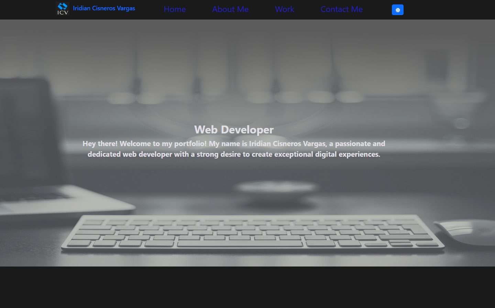
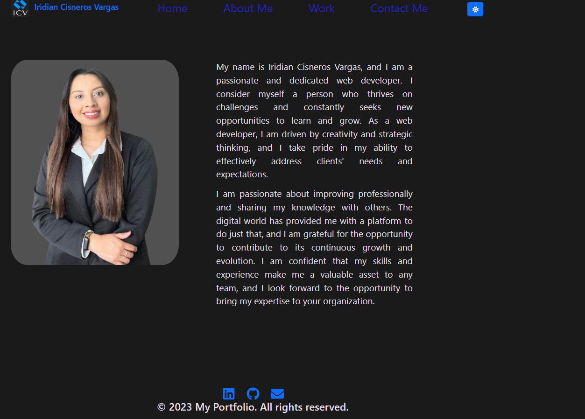

# My portfolio #

Table of Contents

  - [About the project](#abouttheproject)
  - [Installation](#installation)
  - [description](#description)
  - [Usage](#usage)
  - [Credits](#credits)
  - [License](#license)
  - [Contact](#contact)

## About the project ##

 The main purpose of this project is to introduce myself in the working world through my portfolio, it will show people my work done through the time and the avilities and skills I have earned as a web developer. This portfolio shows my individual and team work in order to see my skills built during my bootcamp.

 ## Installation ##
 N/A

 ## Usage ##

 This portfolio helps others to navigate through my personal information as a description of my self in the main page.

 At the top of the page there are 4 sections : 
 - Home
 - About Me
 - Work
 - Contact Me

These 4 sections at the top help people to know about me , my work experience will be in the "work" section, it is attatched to websites I have done once we click on their img and it will send you directly to deployed pages that I have built individually or in teams .I can be contacted in LinkedIn, email, phone or through github in my "Contact" section, and about me section is a brief summary about me.

 ## Description
**Evidence of my portfolio with images**

-link to deployed application: 
[portfolio webpage.]()

## Credits ##
N/A

## License ##
N/A

## Contact 

[GitHub](https://github.com/Naidiri1/)

